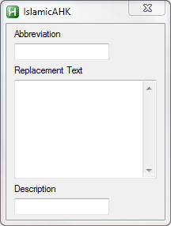

IslamicTextAHK
==============
This is an AutoHotkey script app to expand commonly used Islamic terms. Users can add their own custom expansions as well as modify the defaults.

Installation Instructions
=========================
1. Install [AutoHotkey](http://www.autohotkey.com/).
2. Run the downloaded script.
3. Type any of the predefined shortcuts and it should expand to its counterparts.
3. (Optional) Load the script on Windows startup by storing in the 'startup' folder.
4. (Optional) You can add your own shortcuts by following the format given.

Predefined shortcuts
=====================
- ASA -> Assalamu'alaikum
- WALS -> Wa'alaikum 'Assalam
- pbuh -> (May Allah send blessings and peace upon him)
- s.a.w -> (salla Allaahu 'alayhi wa salaam)
- r.a. -> (RadiAllah 'anhu)
- jzk -> JazakAllah khayran

GUI WIP preview
===================

To Do
======
1. Make it independant of AutoHotkey by turning it into an .exe of its own.
2. Complete GUI interface for easy editing of text shortcuts.